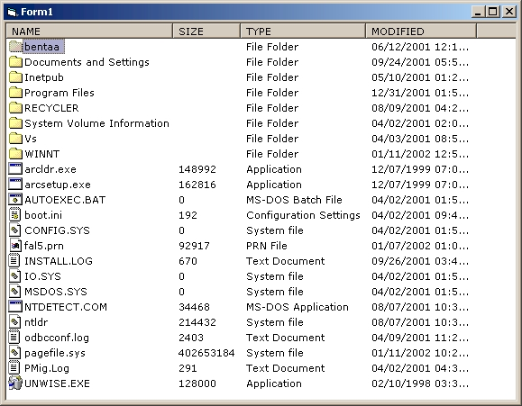



## File ListView

### Description

A little while ago somebody posted a listview that will automatically display a file listing for you. I thought this was a good idea and downloaded it. While it was nice, it had some bugs. Instead of just fixing that code, today I decided to make one myself. 90% of it was made simply using the Active X Control Wizard. I then added some code to read the icons for the files to dispaly in the ListView and few other tweaks to what the wizard made. In the end I have this control for you. While it is functional and easy to understand, you may wish to add/alter the code a bit to make it a bit more robust for all needs. Have fun with it. Simply set the Path property to a full path you wish to display files of and presto. On ItemClick or DblClick you can check and read the ItemType property to determine if the user clicked or double clicked on a Folder or a File ListItem and perform the logic you desire.
 
### More Info
 

             |
---                |---
**Submitted On**   |2002-01-11 13:23:06
**By**             |[Clint LaFever](https://github.com/Planet-Source-Code/PSCIndex/blob/master/ByAuthor/clint-lafever.md)
**Level**          |Intermediate
**User Rating**    |4.4 (31 globes from 7 users)
**Compatibility**  |VB 5\.0, VB 6\.0
**Category**       |[OLE/ COM/ DCOM/ Active\-X](https://github.com/Planet-Source-Code/PSCIndex/blob/master/ByCategory/ole-com-dcom-active-x__1-29.md)
**World**          |[Visual Basic](https://github.com/Planet-Source-Code/PSCIndex/blob/master/ByWorld/visual-basic.md)
**Archive File**   |[File\_ListV479861112002\.zip](https://github.com/Planet-Source-Code/clint-lafever-file-listview__1-30696/archive/master.zip)

